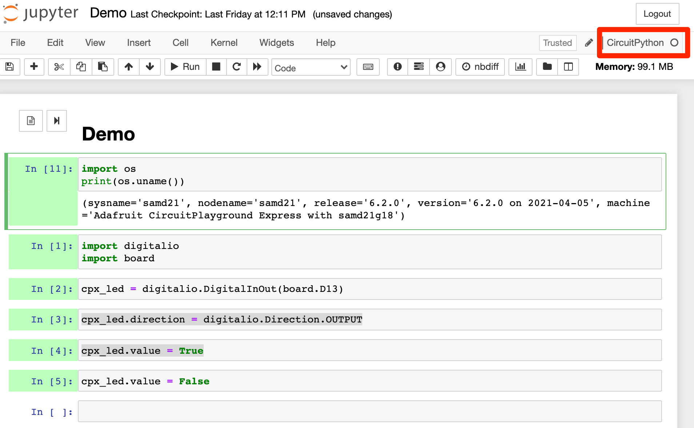

# Circuit Python Express

Notes on getting started with Circuit Playground Express and Circuit Python.

See also: https://github.com/ouseful-testing/circuit-playground-express

## Quick Start

You'll need a micro-USB cable. Apparently, some USB cables are not data cables, they just have a power line. 

If it has the USB logo, you should be good to go...


If you can see writing on the cable, you can also check to see if it is a data cable. Look for markings in a long string of characters of the form `AWG/2` or `AWG/2P`. The `AWG` refer to *American Wire Guide*; the `2` or `2P` means two pairs. The `2` is good. If the `2` is a `1`, you just have a power cable.

If you're interested, the 2 pairs, which make 4 wires, are connected as follows:

<a href="https://en.wikipedia.org/wiki/USB_hardware"></a>

Connect the Circuit Python Express to your computer with the micro-USB data cable.

The Circuit Python Express should start up, and the multi-coloured LEDs around the edge should start lighting up in a circular way.

With a brand new Circuit Playground Express device, it's missing some things we need software wise.

From the [Circuit Playground Express](https://circuitpython.org/board/circuitplayground_express/) website, look for a panel saying __CircuitPython 6.2.0__ (the numbers may be different) and the *Download .UF2 now* button. Click it to download the file.

When I tried, it downloaded as the file `adafruit-circuitpython-circuitplayground_express-en_US-6.2.0.uf2`.

If you want to get the file manually from the command line (ignore this if it means nothing to you!), I used:

`wget https://downloads.circuitpython.org/bin/circuitplayground_express/en_US/adafruit-circuitpython-circuitplayground_express-en_US-6.2.0.uf2`

Open a folder/directory so you can see it, and then look for a little tiny button in the middle of the Circuit Python Express board. It'll have `RESET` written in tiny letters just above it.

__Press the `RESET` button once.__

The lights around the Circuit Python Express should all turn green: the device is in BOOT mode.

On your computer, look to see what disks are mounted. On a Mac it'll be available from a Finder window under *LOCATiONS*. You'll see something similar in the *Computer* area of a folder sidebar where you can see the *C:* drive listed.


If the Circuit Python Express is in BOOT mode (all the LEDs round the edge are green and not flashing) you __should__ see something like a mounted `BOOT` or `CPLAYBOOT` drive.

*On a Mac, you may not. In which case, you are stuck until I find a hack, or unless you have another computer...*


Drag the file you downloaded from the Circuit Python Express website (in my case, the file `adafruit-circuitpython-circuitplayground_express-en_US-6.2.0.uf2`) onto the `BOOT` (`CPLAYBOOT`) drive.

The drive should disappear and the Circuit Playground Express might flash a bit. On your computer, the `BOOT` (`CPLAYBOOT`) drive should be replaced by a `CIRCUITPY` drive. On the Circuit Playground Express, just a single green power status LED should be illuminated.

If you unplug the Circuit Python Express, you may need to give it a kick to reboot each time you reconnect. Try clicking the `RESET` button a couple of times. If that doesn't work, click it again once, maybe?

There are various helper packages and demos available from [here](https://github.com/adafruit/Adafruit_CircuitPython_Bundle/releases/tag/20210506); see the [*Adafruit CircuitPython Library Bundle* docs](https://circuitpython.readthedocs.io/projects/bundle/en/latest/index.html) for more detail.

Download, unzip, and have a rummage around. There are various packages defined in the `lib/` directory of the unzipped "bundle"; you can drag the ones you want over to the `CIRCUITPY` drive and pop them in the `lib/` directory there, then you can import them in the normal way. For example, if you copy over `lib/adafruit_led_animation`, you can `import adafruit_led_animation` (I'm not sure about the extent to which restarting either the editor(?!) or the device is required to make sure newly "installed" (i.e. copied over) packages are registered and available for import.

The bundle also has a `requirements` directory that contains all sorts of stuff. I'm not sure if those items go in a `CIRCUITPY/requirements` directory, or how they are then referenced?


## Programming the Circuit Playground Express

Various editors are available for writing programmes you can send to the Circuit Playground Express.


### Mu Editor

The Mu Editor is a simple Python editor that plays noce the with Circuit Playground Express. Some installation instructions can be found here: [Installing the Mu Editor](https://learn.adafruit.com/adafruit-circuit-playground-express/installing-mu-editor); you can download from https://codewith.mu/ . 

Download it an install it.

With the Circuit Playground Express connected to you computer, start the editor. It may take some time to start up on first run.

It should also detect your Circuit Playground Express


The *Mode* button in the Mu editor toolbar also allows you to set the editor to a Circuit Python Express editor mode:


One thing you may notice about the editor is that there is no *Run* button to run any code you write. This sucks. So check some documentation to find out how to do what should be obvious: [Creating and Editing Code](https://learn.adafruit.com/adafruit-circuit-playground-express/creating-and-editing-code).

At the bottom of the docs, some useful advice:

> CircuitPython looks for a code file on the board to run. There are four options: code.txt, code.py, main.txt and main.py. CircuitPython looks for those files, in that order, and then runs the first one it finds.

An example program, to be saved as `code.py` is given as follows:

```python
import board
import digitalio
import time
 
led = digitalio.DigitalInOut(board.D13)
led.direction = digitalio.Direction.OUTPUT
 
while True:
    print("Hello, CircuitPython!")
    led.value = True
    time.sleep(1)
    led.value = False
    time.sleep(1)
```

If you save it, it should flash an LED. It didn't work for me. Opening the *Serial* console should show some hello messages. It doesn't.

For some reason the program wasn't running when downloaded.

A bit a blind trying seemed to fix things, specifically opening the serial window by clicking the *Serial* toolbar button, `ctrl-c` to get the REPL mode, the `ctrl-d` to relead and rerun the downloaded program.

If you have programming in an infinite loop, `ctrl-c` to stop, then `ctrl-d` to reload and run it again.


You can also take sensor readings from the board.

```python

import time

import analogio
import board
 
light = analogio.AnalogIn(board.LIGHT)
 
while True:
    print((light.value,))
    time.sleep(0.1)
```


If you plot one or more numerical sensor readings as a tuple, you can view the readings as a dynamically created trace in the Plotter window (toggled using the *Plotter* button in the toolbar):


## Writing Circuit Express Playground Programs in Jupyter Notebooks


*Note that things may break if you have the Mu editor in CircuitPython mode and a Circuit Python kernel Jupyter notebook running at the same time. Running more than one Jupyter notebook with a Circuit Python kernel at the same time may also cause issues.*

To control the Circuit Playground Express from a Jupyter notebook, you need a local Jupyter notebook server running. (I haven't figured out how to set run a Docker container that talks to the board yet, so you do need a local notebook server running.

*"Official" docs here: [CircuitPython with Jupyter Notebooks (Adafruit Learning System Guide)](https://learn.adafruit.com/circuitpython-with-jupyter-notebooks)*

If you haven't got a local Jupyter server running, follow the *Anaconda* installation instructions in the OpenLearn [*Learn to Code* Installation Guide](https://www.open.edu/openlearn/learn-to-code-installation).

With the Jupyter notebook server running, open the notebook server homepage in your browser (by default at `localhost:8888`).

Create a new Python Jupyter notebook from the notebook homepage *New* menu (top left of page), enter the following into a code cell, and with the cell highlighted, click the play button in the notebook toolbar to execute the code:

```python
%pip install git+https://github.com/adafruit/circuitpython_jupyter_kernel.git

! python3 -m circuitpython_kernel.install
```


The notebook you are running by default executes the code in the code cells in a Python environment on your computer.

Running the cell should download an install a Circuit Python kernel that will let you execute code in the code cells in a notebook running that kernel on a connected Circuit Playground Express device.

In passing, note that we can also run some simple diagnostics relating to the Circuit Playground Express connection using your computer's Python environment. In the same notebook that you used to install the new kernel, create a new code cell (click the `+` button in the toolbar) copy in the following code and run it to see what port the Circuit Playground Express device is connected to:

```
from serial import Serial
from serial.tools.list_ports import comports

# Vendor ID for SAMD Adafruit
ADAFRUIT_VID = 0x239A
# Vendor ID for Feather Huzzah ESP8266
ESP8266_VID = 0x10C4

for port in comports():
    if port.vid == ADAFRUIT_VID or port.vid == ESP8266_VID:
        print(port)
``` 

I got the following message (on a Mac):

`/dev/cu.usbmodem14101 - CircuitPlayground Express - CircuitPython CDC data`


### Circuit Python Notebooks

Go back to the notebook server homepage and refresh the page. You should now be able to open a Circuit Python notebook from the notebook homepage *New* menu:


You might notice that the new notebook is running the Circuit Python kernel:



Run the following in a code cell to get the device to tell you a little about itself:

```python
import os
print(os.uname())
```


For example, I got the response:

```
(sysname='samd21',
nodename='samd21',
release='6.2.0',
version='6.2.0 on 2021-04-05',
machine='Adafruit CircuitPlayground Express with samd21g18')
```

The line magic command `%softreset` will reset the board and release any and all assigned resources.

Let's see if we can turn a light on for a few seconds...

First, we need to import some required packages and create a reference to one of the LEDs. Paste the following into a new code cell, and run it:

```python
import digitalio
import board

cpx_led = digitalio.DigitalInOut(board.D13)
cpx_led.direction = digitalio.Direction.OUTPUT
```

Now we can call on that LED to turn it on for five seconds. Enter the following into a new code cell and run it:

```python
import time

cpx_led.value = True
time.sleep(5) # Wait time in seconds
cpx_led.value = False
```

You should see a red LED come on to one side of the USB cable for the time specified.

The kernel seems pretty limited (and development appears to have stalled?) so it's quite hard to get feedback into the notebook.

You can do naive things like the following to print out a set of collected values:

```python
import time
 
import analogio
import board

vals=[]
light_=analogio.AnalogIn(board.LIGHT)
for i in range(20):
    vals.append((light_.value,))
    time.sleep(0.1)

print(values)
```

IPython `__repr__` display handlers for displaying the value of the last object in a cell don't appear to be implemented.

It looks as if steps are being made to include some `%python` and %%python` magic to all the running of Pyhton code in a Python environment on host, but at the moment it doesn't appear to want to display outputs in the notebook.

If variables / data could be passed into the `%%python` block magicked cell, and outputs displayed in the normal way, then we would be able to process the data using the full range of Python packages, display charts etc etc.

Whilst you might even be able to use the `%line` magic inline in a Circuit Python program, I suspect you still wouldn't be able to render dynamically rendered charts.


If, as and when I put together any demos, see: https://github.com/ouseful-testing/circuit-playground-express
